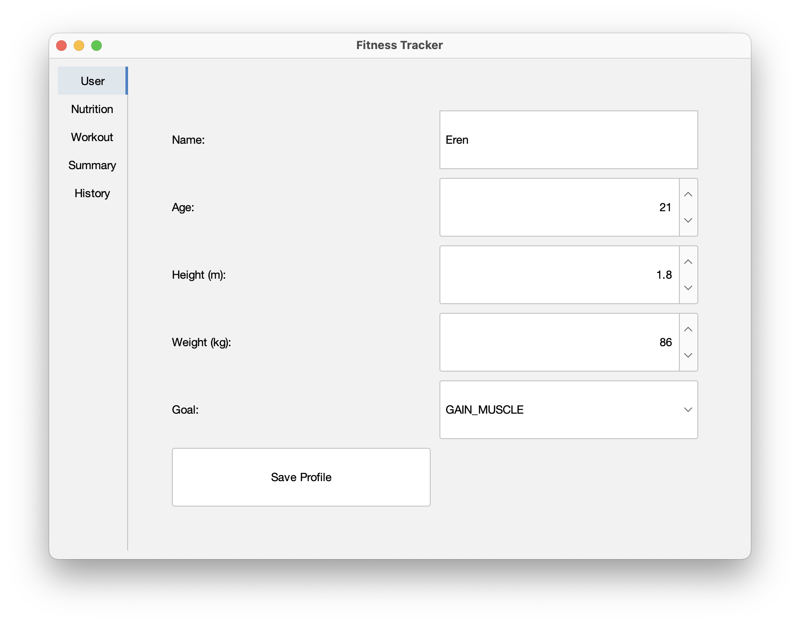
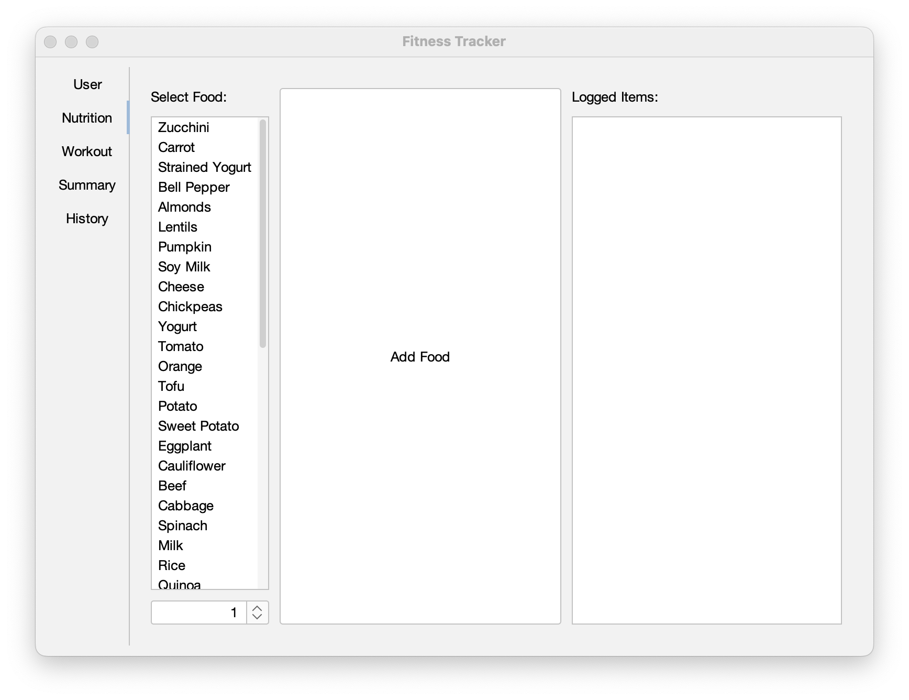
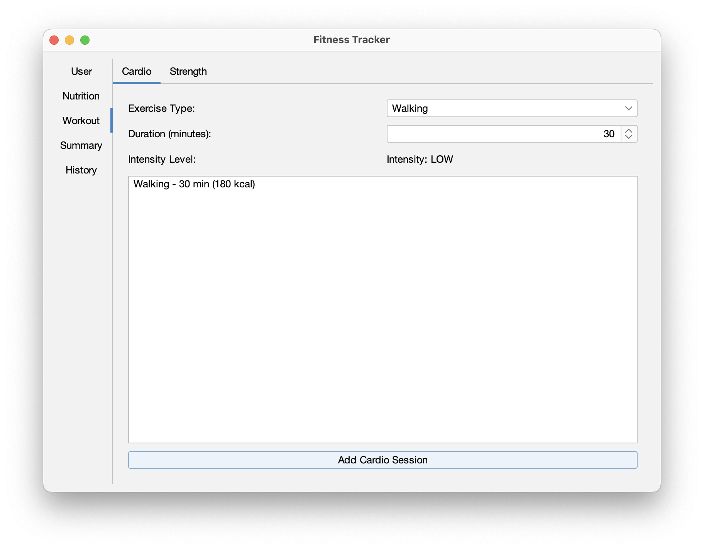
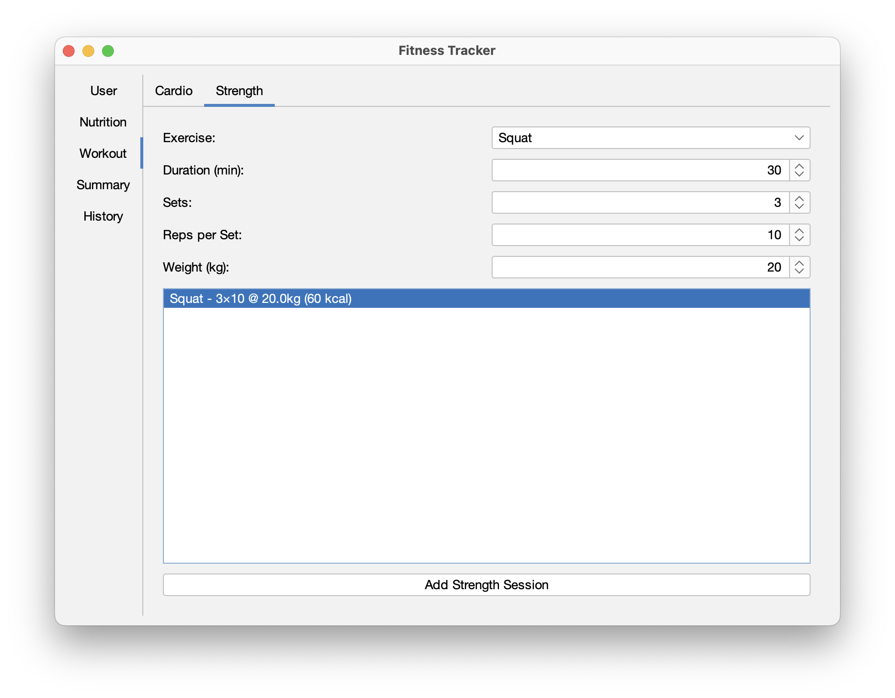
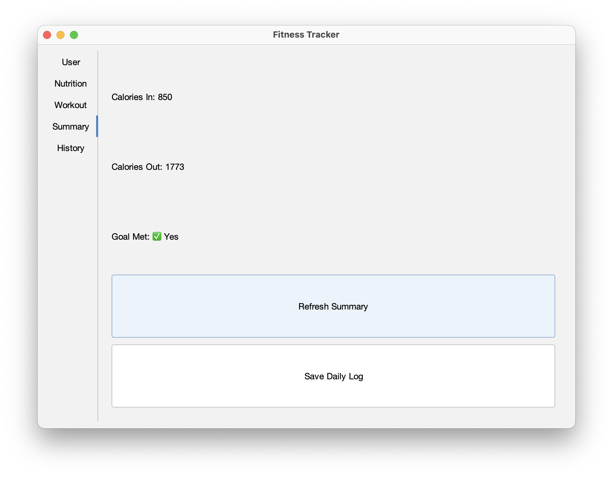
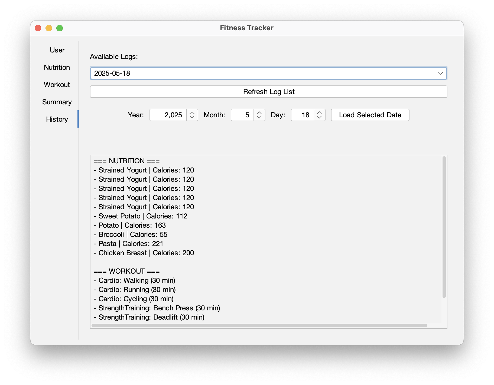

# Fitness Tracker

A fitness tracking application with nutrition, cardio, workout tracking and logging.

## Compiling
This program does not have any external dependencies.

## Installation
Just run the .jar file. Enjoy!

## Interface

### User
In this pane, you can enter your name, age, height, weight, and your fitness goal.

### Nutrition

In this pane, you can add some of the more popular foods consumed by gym-goers. 
Each serving of food is counted as 100 grams.

### Workout

#### Cardio

In this section, you are able to add various cardio exercises you have done in the day. The cardio exercises are assigned intensity levels, which are used to calculate the calorie burn for each exercise.

#### Strength

You can add various strength training exercises in this section. The duration, sets, reps and weights can each be specified.

### Summary

After adding nutrition and workout information, you can see the summary of your workout for the day. According to your user profile and your set workout goal, the app will calculate if you've met or failed your daily goal. You can then write this information to a log file, stored inside the app. Your activity will be logged for the current day.

### History

You can view your past fitness activity in this section. The app automatically lists the dates it has saved, but you can also specify a date and look it up using the "Load Selected Date" button.

## Contributors
Mustafa Semih Özyazıcı

İsmail Sarıtaş

Can Şenyiğit

Eren Sonkurt

Necat Erdem Bayrakdar

This app was made as a STAT295 final project.
